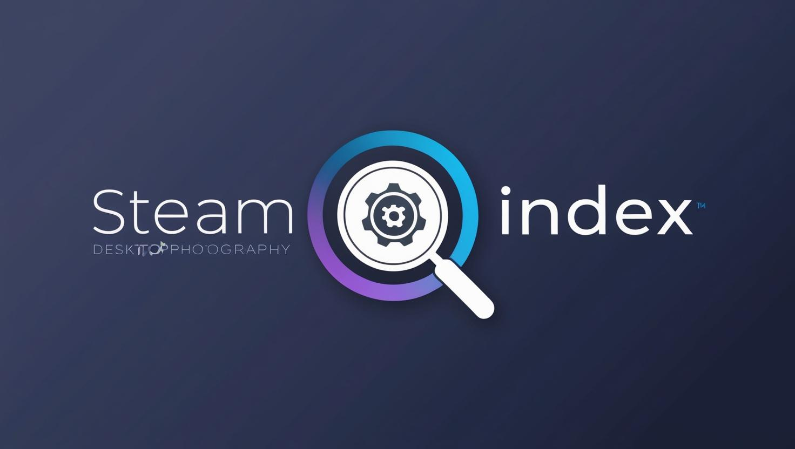

# 🎮 SteamIndex

[](https://github.com/mot204t/SteamIndex)
[](https://github.com/mot204t/SteamIndex)

A **modern desktop application** for exploring the complete Steam application database.  
SteamIndex offers a **sleek, responsive interface** to browse, search, and deep-dive into detailed data on thousands of Steam apps — even offline.



## 📋 Table of Contents
- [Features](#-features)
- [Installation](#-installation)
- [Database Files](#-database-files)
- [Usage Guide](#-usage-guide) 
- [Logging](#-logging)
- [License](#-license)
- [Contact](#-contact)
- [Acknowledgments](#-acknowledgments)

---

## 🚀 Features

- 🔍 **Comprehensive Database**  
  Access information for thousands of Steam apps using a locally stored dataset.

- ⚡ **Fast & Fuzzy Search**  
  Find games or software instantly by name or AppID, with support for fuzzy matching.

- 🧱 **Dual View Modes**  
  Switch between **List View** and **Grid View** (with app images) to suit your browsing style.

- 📋 **Detailed App Information**  
  Get comprehensive metadata including developer, publisher, release date, genres, and more.

- 📤 **Export Your Results**  
  Save search results to `JSON`, `CSV`, or `TXT` formats in one click.

- 📡 **Offline Mode**  
  Full functionality even without an internet connection.

- 🌙 **Dark Theme UI**  
  Clean, modern interface that's easy on the eyes — optimized for extended use.

- 📝 **Centralized Logging**  
  Automatic event logging to timestamped files for diagnostics and debugging.

---

## 📦 Installation

```bash
# 1. Clone the repository
git clone https://github.com/mot204t/SteamIndex.git
cd SteamIndex

# 2. Run the app
start SteamIndex.exe
```

## 🗃 Database Files

SteamIndex requires local database files to function:

- `data/appiddb/appiddb-v2.json` → **Primary Database**
- `data/appiddb/appiddb-v1.json` → **Secondary Database**

On first launch, the necessary directory structure is **auto-created**. Ensure the database files are present in the correct paths.

## 💡 Usage Guide

1. **Launch**:  
   Start the app via `start SteamIndex.exe`.

2. **Search**:  
   Enter a game title or AppID to begin browsing.

3. **View**:  
   Toggle between **List View** or **Grid View** for display options.

4. **Explore Details**:  
   Click any app for a rich overview including categories, release info, and more.

5. **Export**:  
   Use the export button to save your results in the format you need.

## 📑 Logging

All events and errors are logged into the `logs/` folder.  
Each session generates a new log file:  
```
logs_YYYY-MM-DD_HH-MM-SS.txt
```

Useful for debugging and tracing user activity.

## 📄 License

This project has no license.

## 📞 Contact

If you have any issue feel free to contact me through discord:  
**Discord Username**: `mot204t`

## 🙌 Acknowledgments

- Data powered by the **Steam API**
- UI built with **PyQt6**

> _Note: This application is not affiliated with Valve Corporation or Steam._
